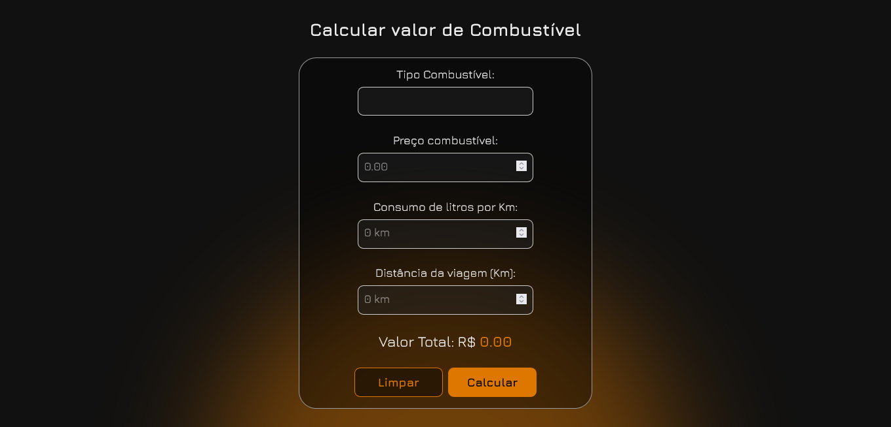

## Calculadora de combustível

• Projeto realizado a partir de um desafio do Bootcamp "Potência Tech iFood" da DIO.

• Neste desafio era necessário criar funções JavaScript para calcular o valor gasto de combustível em uma viagem, onde tudo era mostrado apenas no terminal do computador.

#### Então decidi criar uma interface para este desafio.

### Visitar projeto:

## Preview

